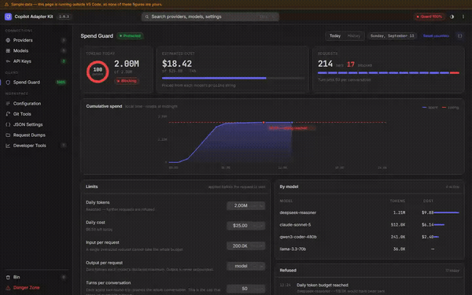
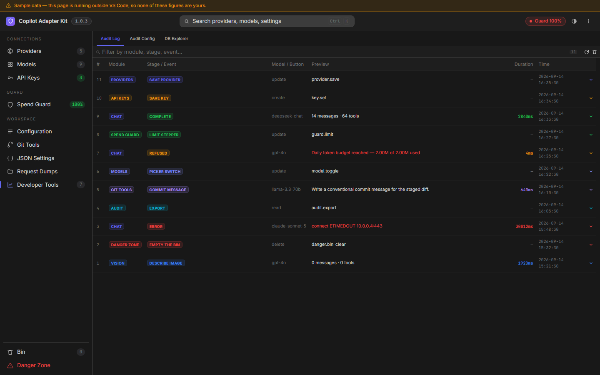
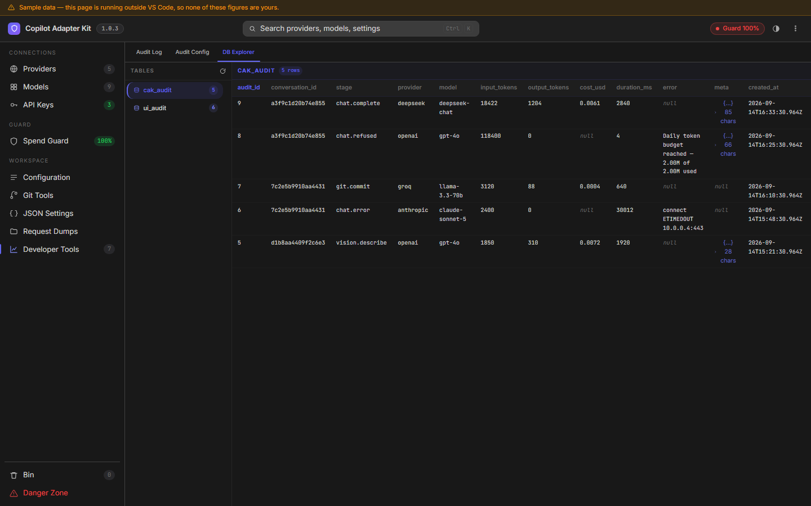
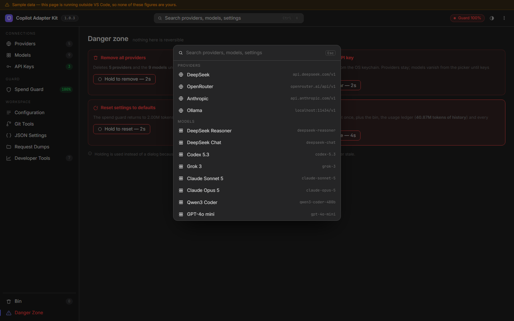
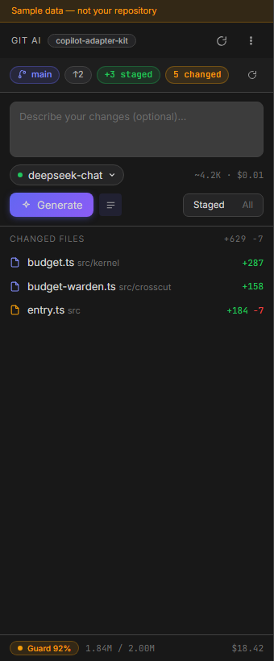

<h1 align="center">
  
  <br/>
  Copilot Adapter Kit
</h1>

<p align="center">
  <strong>Bring your own model to Copilot Chat — with a spend guard in front of it.</strong><br/>
  <em>OpenAI, Anthropic, DeepSeek, Groq, OpenRouter, Ollama, LM Studio, vLLM, or your own endpoint.</em>
</p>

<p align="center">
  <a href="https://marketplace.visualstudio.com/items?itemName=salilvnair.copilot-adapter-kit"></a>
  
  
  
</p>

<p align="center">
  
</p>

<p align="center">
  <a href="docs/demo/showcase.mp4"><strong>▶ Watch the full tour (60s)</strong></a>
  &nbsp;·&nbsp;
  <a href="docs/screenshots/">Every screen</a>
  &nbsp;·&nbsp;
  <a href="CHANGELOG.md">Changelog</a>
</p>

---

## Why this exists

The first version of this extension did what the name says: it put any
OpenAI-compatible model into the Copilot Chat picker. Then an overnight agent run
on a configured provider burned roughly **100 million tokens**, and nothing in the
extension could say how — it counted nothing, capped nothing, and kept no record.

So 2.0 added the part that was missing. Every request now passes a guard that
applies limits **before it is sent**, an audit log records what happened, and the
status bar tells you where you are against the day's budget without opening
anything.

The model picker still works the way it did. It just cannot run away any more.

---

## Install

From the Marketplace: search **Copilot Adapter Kit**, or

```bash
code --install-extension salilvnair.copilot-adapter-kit
```

## Quickstart

1. Click the **⬡** in the status bar → **Settings**
2. **Providers → Add provider** — pick a family, and the endpoint fills itself in
3. Paste your API key (it goes to the OS keychain, never to `settings.json`)
4. **Models → Add model** — the id your provider uses, e.g. `deepseek-chat`
5. Open Copilot Chat and pick it from the model dropdown

That is it. The defaults cap you at 2M tokens and $25 a day; change them in
**Spend Guard** whenever they are wrong for you.

---

## Spend Guard

<p align="center">
  
</p>

Five limits, all applied **before the request leaves**, so a refusal costs
nothing:

| Limit | Default | What it stops |
|---|---|---|
| Daily tokens | 2,000,000 | The day's total, across every provider |
| Daily cost | $25.00 | The same, in money, from each model's pricing |
| Input per request | 200,000 | One oversized prompt taking the whole budget |
| Output per request | model max | **Output is never unbounded** — a missing `max_tokens` is a blank cheque |
| Turns per conversation | 50 | The agent loop. Each tool round-trip resends the whole conversation, so this is the one that actually stops a runaway |

Every limit is typeable as well as steppable — `2M`, `393k` and `$12.50` all
parse. Set any of them to `0` to turn that one off.

**The status bar** carries the day: the mark alone when nothing has run, a
percentage once something has, amber near the limit, red when it is refusing.
The hover draws the day as a sparkline, because the shape says whether spend
crept up all day or arrived in one burst at 3am — which a percentage cannot.

Turning protection off is a deliberate hold, not a click, and the status bar
stays red the whole time it is off.

---

## What it looks like

| | |
|---|---|
|  | **Providers** — every state at once: live, no key, key rejected, not running |
|  | **Models** — grouped by provider; the switch is what the Copilot picker reads |
|  | **Audit Log** — one row per model call and per panel action |
|  | **DB Explorer** — the SQLite store underneath, a table at a time |
|  | **Ctrl K** — providers, models, settings and actions in one search |
|  | **Git AI** — branch, counts, per-file stats, and the cost before you send |

[All 27 screens →](docs/screenshots/)

---

## What it does

**Any OpenAI-compatible endpoint**, plus Anthropic's native Messages API.
Streaming, tool calling, agent mode, thinking blocks, rate-limit retry with
backoff, and readable errors instead of raw 4xx.

**Vision fallback** — a model with no image support can still take images: the
picture goes to a model that can see, and its description goes to the model you
picked. Per-model or global.

**Git AI** — commit messages written by a model you chose, in a sidebar that
shows the branch, the staged counts, the per-file stats and **the cost of the
request before it is sent**.

**An audit log on SQLite** (via sql.js — no native compilation). One row per
model call and per panel action, with the duration, the tokens and the cost.
Prompt and response bodies are **off by default**, because that payload is your
source code; turn them on in Developer Tools when you need them, and they are
then recorded whole.

**Developer Tools** — Audit Log, Audit Config (which events get written down at
all) and DB Explorer, for when "why did this behave differently to yesterday"
needs an answer.

---

## Security

- **Keys live in VS Code SecretStorage.** Never in `settings.json`, never shown
  back to the panel — the UI shows that a key exists, its health and its age.
- **Nothing is ever sent anywhere to "test" a key.** Reachability is probed with
  `GET /models` and **no key attached**; key validity is inferred only from real
  4xx responses during actual use.
- **The audit log never records a key or a request header** — only the API path.
- **Bodies are off by default.** When on, they are clipped by nothing and kept
  for `audit.retentionDays` (30 by default).

---

## Commands

| Command | Does |
|---|---|
| `Copilot Adapter Kit: Open Panel` | The settings panel |
| `Copilot Adapter Kit: Open Status Menu` | The menu the status bar opens |
| `Copilot Adapter Kit: Show Token Usage` | The Spend Guard dashboard |
| `Copilot Adapter Kit: Add Provider` / `Remove Provider` | Providers, from the palette |
| `Copilot Adapter Kit: Add Model` / `Remove Model` | Models, from the palette |
| `Copilot Adapter Kit: Set API Key` / `Clear API Key` | Keys |
| `Copilot Adapter Kit: Reset Today's Counters` | Zero the day |
| `Copilot Adapter Kit: Enable / Disable Spend Guard` | Protection on or off |
| `Copilot Adapter Kit: Generate Commit Message` | Git AI, without the sidebar |
| `Copilot Adapter Kit: Open Request Dumps` | The dump folder |

---

## Settings reference

Everything under `copilot-adapter-kit.*`. The panel writes all of it; this is
here for the times you would rather edit JSON.

### Providers

```jsonc
{
  "copilot-adapter-kit.providers": {
    "<uuid>": {
      "uuid": "<uuid>",
      "family": "openai",                      // which engine answers for it
      "name": "My OpenAI",
      "baseUrl": "https://api.openai.com/v1",
      "defaultApiPath": "/chat/completions",
      "modelApiPaths": { "codex-5.3": "/responses" },
      "modelAlias": { "gpt-4o": "gpt-4o-2024-08-06" },
      "visionFallback": "openai:gpt-5.2"
    }
  }
}
```

Providers are keyed by UUID and carry their family as a field — everything
resolves them *by* family, so an entry without one can never be found.

### Models

```jsonc
{
  "copilot-adapter-kit.models": {
    "<provider uuid>": [
      {
        "id": "deepseek-chat",
        "name": "DeepSeek Chat",
        "family": "deepseek",
        "maxIn": 128000,
        "maxOut": 8192,
        "image": false,
        "thinking": false,
        "toolCalling": 128,
        "pricing": "$0.27 / $1.10"
      }
    ]
  }
}
```

A map keyed by provider UUID, not a flat array.

### Spend Guard

```jsonc
{
  "copilot-adapter-kit.budget.enforce": true,
  "copilot-adapter-kit.budget.dailyTokenLimit": 2000000,
  "copilot-adapter-kit.budget.dailyCostLimitUsd": 25,
  "copilot-adapter-kit.budget.maxInputTokensPerRequest": 200000,
  "copilot-adapter-kit.budget.maxOutputTokens": 0,       // 0 = the model's own maximum
  "copilot-adapter-kit.budget.maxTurnsPerConversation": 50
}
```

### Everything else

| Setting | Default | |
|---|---|---|
| `maxTokens` | `0` | Output ceiling sent as `max_tokens`. `0` = the model's own |
| `visionFallbackModel` | `""` | `family:modelId`, or empty to disable |
| `visionFallbackAlways` | `false` | Preprocess images even for models that can see |
| `systemPrompt` | `""` | Placeholders: `{model}`, `{date}`, `{tools}`, `{cakVersion}` |
| `userPromptTemplate` | `""` | Wrapper for each turn. `{userMessage}` |
| `gitPrompt` | built-in | The commit-message prompt. `{branch}`, `{repo}`, `{diff}`, `{guidance}` |
| `maxDiffFiles` | `500` | Above this, Git Tools sends stats instead of the whole diff |
| `stabilizeTools` | `false` | Pre-activate tools so the tools array stops shifting between turns |
| `logLevel` | `quiet` | `quiet`, `meta`, or `dump` |
| `audit.enabled` | `true` | Record model calls at all |
| `audit.recordBodies` | `false` | Record prompts and responses. **Your source code** |
| `audit.retentionDays` | `30` | Pruned on activation. `0` keeps everything |
| `audit.dbPath` | `""` | Where the SQLite file lives |
| `health.probeIntervalMinutes` | `5` | How long a reachability answer is reused. `0` = every panel open |
| `hiddenCustomModels` | `[]` | Written by the picker switch |

---

## Architecture

Every request from Copilot Chat passes through an interceptor chain, **guard
first**:

```
Copilot  →  BudgetWarden  →  AuditRecorder  →  RateLimitGuard  →  ErrorWarden  →  DiagTracer  →  Engine
             refuse/allow     one row           429 retry ×3      readable       fingerprint     SSE
```

`BudgetWarden` runs first on purpose: a refusal has to happen before anything
reaches the network, or it is not a limit, it is a report. `AuditRecorder` runs
second so a refusal is recorded **with its reason**.

```
src/
  entry.ts              activation, commands, status bar
  kernel/               budget ledger, provider config, health, secrets
  mesh/                 engine contract, discovery, the interceptor pipeline
    engines/            openai (OpenAI-compatible), anthropic (Messages API)
  conduit/              the LanguageModelChatProvider VS Code sees
  crosscut/             budget-warden, audit-recorder, rate-limit, errors, tracing
  storage/              sql.js audit database
  panel/                webview hosts, status bar and menu
webview-ui/             React 19 + Vite + Tailwind 4 + @salilvnair/dui
  src/app/screens/      one file per destination
  src/app/devtools/     Audit Log, Audit Config, DB Explorer
  e2e/                  Playwright specs driving every screen
test/                   node suites: spend guard, packaging, contracts, db, health
scripts/                screenshots, demo video
```

---

## Developing

```bash
npm install && npm --prefix webview-ui install
npm run compile          # webview build + esbuild bundle + tsc
npm run test:all         # node suites + Playwright
```

Press **F5** for the Extension Development Host.

The extension host is bundled with esbuild into `dist/extension.js` — nothing is
resolved from `node_modules` at runtime, which is what `test/packaging.test.js`
exists to keep true.

### Regenerating the media

```bash
npm run screenshots      # docs/screenshots/, every screen and tab
npm run showcase         # the demo video and GIF, into docs/demo/
```

Both drive the real UI against the Vite dev server with the fixture in
`webview-ui/src/app/fixture.ts`, so every frame carries the amber sample-data
bar. Nothing in any image or video is anyone's real usage.
See [`scripts/demo-video/README.md`](scripts/demo-video/README.md) for the
recipes, the camera-move vocabulary and how to add a segment.

---

## Troubleshooting

**"SQLite did not start"** — fixed in 2.0.1. Update; if it persists, Developer
Tools names the error and everything else keeps working.

**A model does not appear in the Copilot picker** — it needs a provider with a
key, and its picker switch on (Models). A model whose `family` has no provider
behind it cannot resolve.

**"Model does not support images"** — set a vision fallback, globally or on that
model, and reload the window.

**Requests are being refused** — that is the Spend Guard. The status menu says
which limit and how far over you are; the Spend Guard screen is where you change
it.

**Something failed and the message is unhelpful** — every command reports the
command that failed with a **Show log** action, and the output channel has the
stack.

---

## Licence

MIT © [salilvnair](https://github.com/salilvnair)
